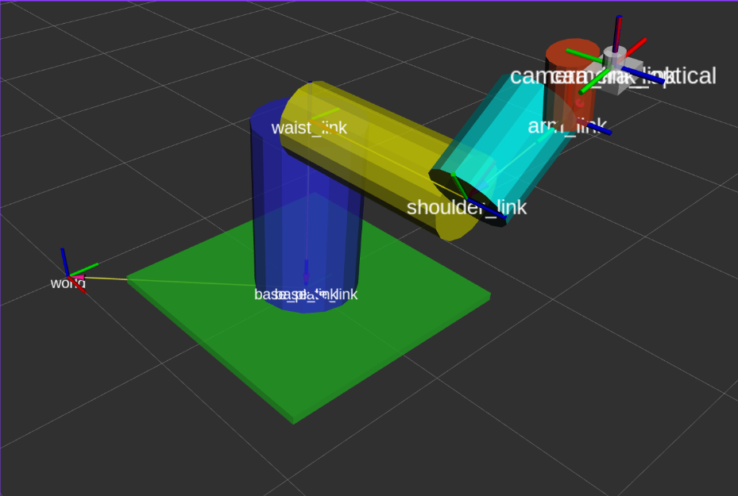

# PUMA500ROSRviz
> Simulation of six degree of freedom robotics arm : PUMA 500 using ROS, RViz, and Gazeboo
This repo contains a URDF file and a launch script to run it. (ROS 2)

## How To Run
1. Build the package with colcon.
2. Launch the `robot_state_publisher` launch file with `ros2 launch urdf_example rsp.launch.py`.
3. Launch `joint_state_publisher_gui` with `ros2 run joint_state_publisher_gui joint_state_publisher_gui`. You may need to install it if you don't have it already.
4. Launch RViz with `rviz2`

To replicate the RViz display shown in the video you will want to
- Set your fixed frame to `world`
- Add a `RobotModel` display, with the topic set to `/robot_description`, and alpha set to 0.8
- Add a `TF` display with names enabled.

# Reference
[Reference](https://articulatedrobotics.xyz/ready-for-ros-7-urdf/)
